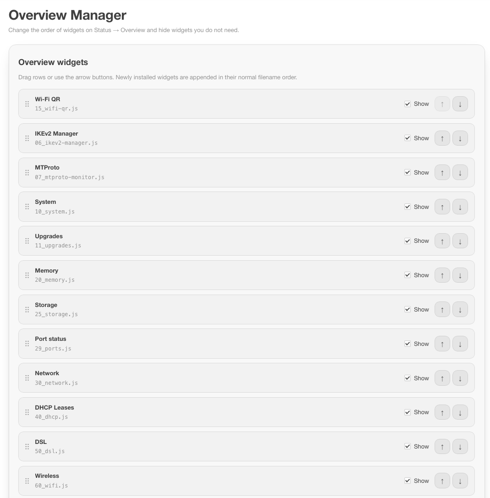

# Overview Manager для OpenWrt

[English](README.md)

[](https://github.com/Nikitid/luci-app-overview-manager/actions/workflows/ci.yml)
[](https://github.com/Nikitid/luci-app-overview-manager/releases/latest)
[](LICENSE)

Пакет `luci-app-overview-manager` - LuCI-приложение для настройки карточек на
странице **Status -> Overview**.



## Возможности

- порядок виджетов меняется перетаскиванием или кнопками "выше" и "ниже";
- ненужные карточки скрываются полностью;
- работает со сторонними виджетами, установленными как LuCI status include;
- раскладка хранится в UCI и общая для всех браузеров.

## Требования

- официальный OpenWrt `24.10.x` с `opkg`;
- официальный OpenWrt `25.12.x` с `apk`;
- стандартная страница `luci-mod-status` Status Overview;
- сторонние виджеты, установленные как LuCI status include.

В OpenWrt 25.12 штатная кнопка Hide хранит состояние отдельно в
`localStorage` конкретного браузера. Она продолжает работать независимо от
общей раскладки Overview Manager.

## Установка

### OpenWrt 24.10

Скачайте `luci-app-overview-manager_*_all.ipk` из
[Releases](https://github.com/Nikitid/luci-app-overview-manager/releases) и загрузите его
через **System -> Software -> Upload Package**.

### OpenWrt 25.12

```sh
wget -O /tmp/nikitid-feed.sh \
  https://raw.githubusercontent.com/Nikitid/openwrt-feed/feed/install.sh
sh /tmp/nikitid-feed.sh luci-app-overview-manager
```

Установщик проверяет публичный ключ издателя по закреплённой контрольной сумме,
подключает общий подписанный репозиторий приложений и ставит только указанный
пакет.

Последующие обновления:

```sh
apk update
apk upgrade luci-app-overview-manager
```

Обновляется только Overview Manager, а не все пакеты роутера.

## Как это работает

Штатный LuCI загружает файлы из
`/www/luci-static/resources/view/status/include` в алфавитном порядке.
Overview Manager добавляет ранний служебный include, сопоставляет карточки с
исходными файлами и применяет сохранённую в UCI раскладку к DOM.

Файлы других пакетов не изменяются, не переименовываются и не удаляются.
После удаления Overview Manager штатное поведение LuCI восстанавливается
автоматически.

## Переводы

Интерфейс использует штатный механизм LuCI: `_()` в JavaScript и каталоги
gettext в `po/`. При сборке `po/<язык>/overview-manager.po` компилируется в
`/usr/lib/lua/luci/i18n/overview-manager.<язык>.lmo` и попадает в основной
пакет, а `/etc/uci-defaults/luci-app-overview-manager` регистрирует язык в
`luci.languages`. Язык интерфейса следует настройке LuCI, отдельный пакет
`luci-i18n-*` не требуется.

Пакет переводит только свои строки: для полностью русского LuCI нужен ещё
`luci-i18n-base-ru`. Новый язык добавляется каталогом
`po/<язык>/overview-manager.po`; соответствие каталогов исходникам проверяет
`scripts/test-po2lmo.py`.

## Ограничения

У LuCI status include нет общего описания внутренних полей: каждый виджет
реализует произвольные `load()` и `render()`. Поэтому Overview Manager
настраивает порядок и видимость карточек, но не редактирует их содержимое.

Скрытый виджет не отображается, однако его штатный сбор данных может
продолжать выполняться при опросе страницы.

## Разработка

```sh
./scripts/ci-check.sh
```

Сборка, подпись и выпуск: [docs/DEVELOPMENT.md](docs/DEVELOPMENT.md).

## Документация

- [Карта репозитория](docs/MAP.md) - где что лежит
- [Архитектура](docs/ARCHITECTURE.md) - почему страница устроена именно так
- [Разработка](docs/DEVELOPMENT.md) - сборка, подпись и выпуск

## Поддержка

Вопросы и сообщения об ошибках - в
[Issues](https://github.com/Nikitid/luci-app-overview-manager/issues/new/choose), выберите
подходящую форму. Об уязвимости сообщайте приватно через
[security advisory](https://github.com/Nikitid/luci-app-overview-manager/security/advisories/new).
Можно писать по-русски или по-английски.

## Лицензия

[MIT](LICENSE)
